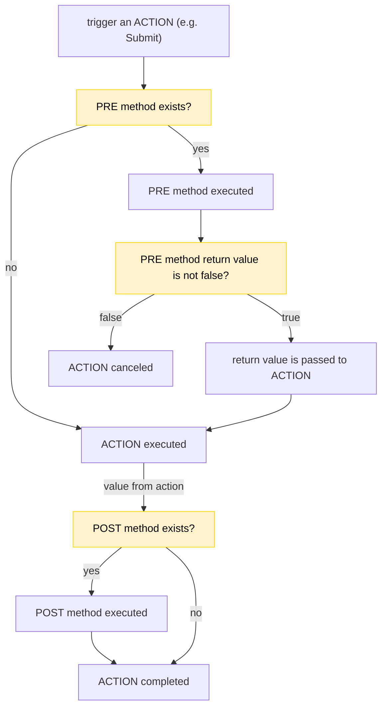

# Interceptors Developer Guide

An interceptor is a record in Advanced Configuration options in the Pricefx application and it contains a JavaScript code. The record name has to start with a prefix `pfxInterceptor_` and then it has to continue with the actual interceptor name. A correct name is, for example, `pfxInterceptor_myFirstExperiment`.

The record cannot be empty; if it is, Pricefx will show an error: “The interceptor with name pfxInterceptor_myFirstExperiment was not found”.

It has to contain at least one exported Javascript constant with a function such as this:

```
export const quotesDetailOpen = async () => {
  // Code which will be triggered when a user opens an existing quote
}
```

If you need to add custom behavior at more places, just export more constants:

```
export const quotesDetailNew = async () => {
  // This will trigger at a new quote
}

export const quotesDetailOpen = async () => {
  // This will trigger at an existing one
}

export const quotesDetailSubmit = async () => {
  // This will trigger when a user presses the Submit button at a quote detail
}
```

A list of all possible constant names which can be exported from the interceptor code is [here](./modules/Interceptor_Methods.html).

To make the interceptor active you have to set it at **Administration > Configuration > Interceptors**.
This page also contains all possible constant names mentioned above.

It is **visible only** if you have the user role `Develop Interceptors`.

For more details see [Pricefx Knowledge Base](https://pricefx.atlassian.net/wiki/spaces/KB/pages/4136468568/Dynamic+Interceptors#Step-by-step%3A-How-to-develop-new-dynamic-interceptor).

See also other sources: [reference](https://pricefx.atlassian.net/wiki/spaces/KB/pages/4135191425/Interceptors+Reference)
and [configuration](https://pricefx.atlassian.net/wiki/spaces/UNITY/pages/4121723726/Interceptors).

## Pre & Post Methods

Each [named constant](./modules/Interceptor_Methods.html) can exist in two variants, one is for the `PRE` action with a suffix Pre and the second one for the `POST` action where the suffix is omitted.

```javascript
export const quotesDetailSubmitPre = () => {
  console.log('This will be triggered before quotesDetailSubmit');
};

export const quotesDetailSubmit = () => {
  console.log('Test 1');
};
```

You do not need to implement both variants. In some cases only the `PRE` action makes sense, for others it is only the `POST` action.

### Processing

When a user **triggers an action**, for example quote submit, Pricefx checks if the **PRE action** exists (`quotesDetailSubmitPre` in our submit example).

If this method exists, then is processed and the return value is used to decide if to continue or not. For `false`, the **action is canceled**. Other non-false values are passed to **Pricefx action**.

After **Pricefx action** we check if the **POST action** exists (`quotesDetailSubmit`) and if does, then it is processed. Some **POST actions** will obtain data from **Pricefx action**.



## APIs

### InterceptorMethodAPI

This [API](./interfaces/app_context_crmIntegration_dynamicInterceptors_interceptorContextMethodTypes.InterceptorMethodAPI.html) is available in each intercepted method and here is how to access it:

```
export const quotesDetailSubmit = async ({ api }) => {
  // code
}
```

### ClicInterceptorAPI

For Quotes, Contracts, Rebate Agreements and Compensation Plans you can use [ClicInterceptorAPI](./types/CLIC_Interceptor_API.ClicInterceptorAPI.html) to manipulate CLIC objects.
Name of this API will vary based on the module where you are using. For Quotes it will be:

```
export const quotesDetailAccountAssign = ({ quoteAPI }) => {
  // code
}
```

- Compensation Plans: `compensationPlanAPI`
- Contracts: `contractAPI`
- Rebate Agreements: `rebateAgreementAPI`
- Quotes: `quoteAPI`

## Example

Intercepted method for creating a new Contract.

```
export const contractsDetailNew = async ({
  contractAPI,
  api: { crmManager, configuration },
}) => {
  const payload = await crmManager.getPayload();
  const appEnv = await configuration.retrieveConfig("applicationEnvironment");
  const isOpportunity = await crmManager.isOpportunityPage();
  const isAccount = await crmManager.isAccountPage();

  if (isOpportunity) {
    const opportunityId = await crmManager.getOpportunityAssociatedValue();
    await contractAPI.setHeaderValue("externalRef", opportunityId);
  }

  if (isAccount) {
    if (appEnv === "salesforce") {
      const customerIdSF = await crmManager.getAccountAssociatedValue();
      const customerLabel = `${customerIdSF} (CustomerID)`;

      if (customerIdSF) {
        await contractAPI.setHeaderInputValue("CustomerGroup", {
          customerFieldName: "customerId",
          customerFieldValue: customerIdSF,
          label: customerLabel,
        });
      } else {
        await contractAPI.setHeaderInputValue("CustomerGroup", {
          customerFieldName: "customerId",
          customerFieldValue: payload.Account_Num__c,
          label: `${payload.Account_Num__c} (CustomerID)`,
        });
      }
    }
  }
};
```
